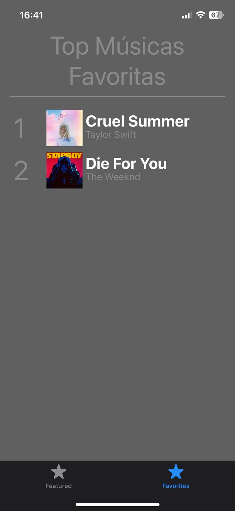

# Top Músicas App - Dados estaticos 

Um aplicativo iOS para exibir listas de músicas e suas informações detalhadas.

## Sobre o Projeto

O Top Músicas App é um aplicativo iOS que permite aos usuários visualizar listas de músicas populares e suas informações detalhadas, incluindo detalhes como nome da música, artista, reproduções e duração. O aplicativo também oferece a capacidade de marcar músicas como favoritas e exibir uma lista de músicas favoritas.

## Capturas de Tela
### Tela de Listagem das Top Músicas


### Tela de Listagem das Músicas Favoritas


### Tela de Detalhes da Música


## Recursos

- Exibição de listas de músicas populares
- Detalhes de músicas, incluindo nome, artista, reproduções e duração
- Marcação de músicas como favoritas
- Exibição de uma lista de músicas favoritas

## Instalação

1. Clone este repositório: 
    ```
    git clone https://github.com/LucasFelip/spotifyiOS.git
    ```
2. Navegue até o diretório do projeto:
     ```
    cd spotifyiOS
    ```
3. Abra o projeto no Xcode.
4. Compile e execute o aplicativo no simulador ou dispositivo.

## Como Usar

1. Abra o aplicativo.
2. Na tela inicial, você verá uma lista de músicas populares.
3. Toque em uma música para ver seus detalhes.
4. Na tela de detalhes da música, você pode marcar a música como favorita tocando no botão de favorito.
5. Toque na guia "Favoritas" na parte inferior para ver a lista de suas músicas favoritas.

## Desenvolvido por
[](https://github.com/LucasFelip)
**Lucas Ferreira** \
[**IFMA**](https://portal.ifma.edu.br/inicio/) • São Luís \
Linguagens & Tecnologias: `Java`, `IntelliJ`

<br>

[](https://github.com/Hasky2309)
**João Guilherme** \
[**IFMA**](https://portal.ifma.edu.br/inicio/) • Pinheiro \
Linguagens & Tecnologias: `CSS`, `HTML`

<br><br>